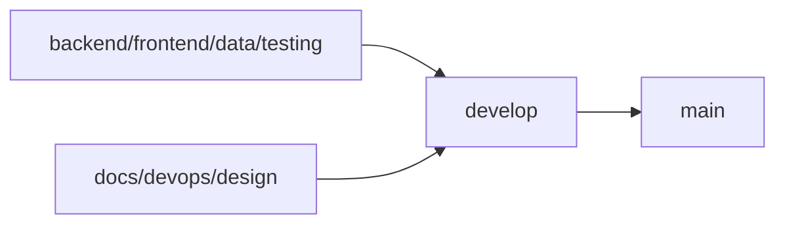

# 📊 Plataforma de Analítica de Datos para Toma de Decisiones

> Sistema centralizado de análisis de datos empresariales con dashboards interactivos, reportería personalizada y análisis predictivo en tiempo real.

[](https://github.com/tu-org/analytics-platform)
[](LICENSE)
[](https://github.com/tu-org/analytics-platform)

---

## 🎯 Objetivos del Proyecto

- ✅ Reducir el tiempo de generación de reportes ejecutivos en un **70%**
- ✅ Centralizar fuentes de información dispersas en diferentes sistemas
- ✅ Democratizar el acceso a información estratégica en la organización
- ✅ Facilitar la identificación temprana de tendencias y patrones de negocio
- ✅ Mejorar la precisión en la toma de decisiones mediante análisis basado en datos

---

## 🏗️ Arquitectura del Proyecto

```
📦 Plataforma de Analítica de Datos
├── 🔧 backend/          # API REST, lógica de negocio, autenticación
├── 🎨 frontend/         # Dashboards, visualizaciones, UI/UX
├── 📊 data/             # ETL, análisis, modelos predictivos
├── 🧪 tests/            # Pruebas unitarias, integración, E2E
├── 📚 docs/             # Documentación técnica y de usuario
├── 🐳 devops/           # Docker, CI/CD, infraestructura
├── 🎨 design/           # Wireframes, mockups, prototipos
└── 📋 requirements/     # Documentos de requerimientos
```

---

## 🚀 Inicio Rápido

### Prerrequisitos

- **Node.js** >= 18.x
- **Python** >= 3.10
- **PostgreSQL** >= 14
- **Docker** >= 24.x (opcional)
- **Git** >= 2.x

### Instalación con Docker (Recomendado)

```bash
# Clonar el repositorio
git clone https://github.com/tu-org/analytics-platform.git
cd analytics-platform

# Levantar todos los servicios
docker-compose up -d

# La aplicación estará disponible en:
# Frontend: http://localhost:3000
# Backend API: http://localhost:8000
# Documentación: http://localhost:8000/docs
```

### Instalación Manual

#### Backend

```bash
cd backend
python -m venv venv
source venv/bin/activate  # Windows: venv\Scripts\activate
pip install -r requirements.txt
python manage.py migrate
python manage.py runserver
```

#### Frontend

```bash
cd frontend
npm install
npm run dev
```

#### Data Pipeline

```bash
cd data
pip install -r requirements.txt
jupyter notebook  # Para exploración de datos
```

---

## 📂 Estructura Detallada

### Backend (`/backend`)

```
backend/
├── api/                 # Endpoints REST
├── auth/                # Autenticación y autorización
├── core/                # Configuración central
├── integrations/        # Conectores a fuentes de datos
├── models/              # Modelos de datos
├── services/            # Lógica de negocio
├── utils/               # Utilidades compartidas
└── tests/               # Pruebas del backend
```

### Frontend (`/frontend`)

```
frontend/
├── public/              # Archivos estáticos
├── src/
│   ├── components/      # Componentes reutilizables
│   ├── pages/           # Páginas de la aplicación
│   ├── services/        # Servicios API
│   ├── store/           # Estado global (Redux/Zustand)
│   ├── styles/          # Estilos globales
│   └── utils/           # Utilidades frontend
└── tests/               # Pruebas del frontend
```

### Data (`/data`)

```
data/
├── notebooks/           # Jupyter notebooks para análisis
├── scripts/
│   ├── etl/             # Extract, Transform, Load
│   ├── analysis/        # Scripts de análisis
│   └── ml/              # Modelos de Machine Learning
├── raw/                 # Datos crudos (no versionados)
├── processed/           # Datos procesados
└── models/              # Modelos entrenados
```

---

## 🌿 Estrategia de Ramas Git

### Ramas Base (Obligatorias)

| Rama | Propósito | Protección |
|------|-----------|------------|
| `main` | Versión estable de producción | ✅ Protegida |
| `develop` | Integración de todas las ramas | ✅ Protegida |

### Ramas por Rol

| Rama | Responsable | Área de Trabajo |
|------|-------------|-----------------|
| `backend` | Backend Developer | `/backend` |
| `frontend` | Frontend Developer | `/frontend` |
| `data` | Data Analyst/Scientist | `/data` |
| `testing` | QA Engineer | `/tests` |
| `docs` | Technical Writer | `/docs` |
| `devops` | DevOps Engineer | `/devops`, Docker, CI/CD |
| `design` | UX/UI Designer | `/design` |

### Flujo de Trabajo



1. Cada desarrollador trabaja en su rama específica
2. Cambios se integran en `develop` mediante Pull Request
3. `develop` se mergea a `main` solo para releases oficiales

---

## 🛠️ Stack Tecnológico

### Backend
- **Framework**: FastAPI / Django REST Framework
- **Base de Datos**: PostgreSQL + Redis (cache)
- **ORM**: SQLAlchemy / Django ORM
- **Autenticación**: JWT + OAuth2

### Frontend
- **Framework**: React 18 + TypeScript
- **UI Library**: Material-UI / Ant Design
- **Visualización**: Recharts, D3.js, Apache ECharts
- **Estado**: Redux Toolkit / Zustand
- **Build**: Vite

### Data & Analytics
- **ETL**: Apache Airflow / Prefect
- **Análisis**: Pandas, NumPy, SciPy
- **Visualización**: Matplotlib, Seaborn, Plotly
- **ML**: Scikit-learn, TensorFlow (futuro)

### DevOps
- **Containerización**: Docker + Docker Compose
- **CI/CD**: GitHub Actions
- **Monitoreo**: Prometheus + Grafana
- **Cloud**: AWS / Azure (por definir)

---

## 📊 Módulos Principales

### 1. Gestión de Usuarios y Seguridad
- Autenticación multifactor (2FA)
- Roles: Administrador, Analista, Consultor, Ejecutivo
- Auditoría completa de acciones

### 2. Integración de Datos
- Conectores para SQL, CSV, APIs, Excel
- Actualización automática (tiempo real, horaria, diaria)
- Validación de calidad de datos

### 3. Dashboards Interactivos
- 15+ tipos de gráficos
- Drag-and-drop builder
- Filtros y drill-down
- Responsive design

### 4. Reportería Personalizada
- Exportación: PDF, Excel, CSV, PowerPoint
- Plantillas predefinidas
- Envío automático por email

### 5. Análisis y Métricas
- KPIs configurables
- Comparaciones período sobre período
- Análisis de correlaciones
- Fórmulas personalizadas

### 6. Alertas y Notificaciones
- Alertas basadas en umbrales
- Notificaciones por email y plataforma
- Recomendaciones automáticas

---

## 🧪 Testing

```bash
# Backend tests
cd backend
pytest tests/ --cov=. --cov-report=html

# Frontend tests
cd frontend
npm run test
npm run test:e2e

# Data pipeline tests
cd data
pytest scripts/tests/
```

---

## 📚 Documentación

- **[Documentación Técnica](docs/technical/)**: Arquitectura, API, base de datos
- **[Manual de Usuario](docs/user-guide/)**: Guías paso a paso
- **[Guía de Contribución](docs/CONTRIBUTING.md)**: Cómo contribuir al proyecto
- **[API Reference](http://localhost:8000/docs)**: Documentación interactiva de la API

---

## 🤝 Contribución

1. Fork el proyecto
2. Crea tu rama de feature (`git checkout -b feature/AmazingFeature`)
3. Commit tus cambios (`git commit -m 'Add some AmazingFeature'`)
4. Push a la rama (`git push origin feature/AmazingFeature`)
5. Abre un Pull Request hacia `develop`

Ver [CONTRIBUTING.md](docs/CONTRIBUTING.md) para más detalles.

---

## 📈 Roadmap

### Fase 1: Fundamentos (Meses 1-3) ✅
- [x] Estructura de proyecto
- [ ] Autenticación y autorización
- [ ] Integración con 3 fuentes de datos principales
- [ ] 5 dashboards básicos

### Fase 2: Expansión (Meses 4-6)
- [ ] Sistema de reportería completo
- [ ] Alertas y notificaciones
- [ ] 10+ tipos de visualizaciones
- [ ] API pública

### Fase 3: Optimización (Meses 7-9)
- [ ] Análisis predictivo básico
- [ ] Optimización de rendimiento
- [ ] Pruebas de carga
- [ ] Despliegue en producción

---

## 📄 Licencia

Este proyecto está bajo la Licencia MIT - ver el archivo [LICENSE](LICENSE) para más detalles.

---

## 👥 Equipo

- **Product Owner**: [Nombre]
- **Backend Lead**: [Nombre]
- **Frontend Lead**: [Nombre]
- **Data Lead**: [Nombre]
- **DevOps Lead**: [Nombre]
- **QA Lead**: [Nombre]

---

## 📞 Contacto

- **Email**: analytics-platform@empresa.com
- **Slack**: #analytics-platform
- **Jira**: [Link al proyecto]

---

<div align="center">
  <strong>Hecho con ❤️ por el equipo de Analítica de Datos</strong>
</div>
