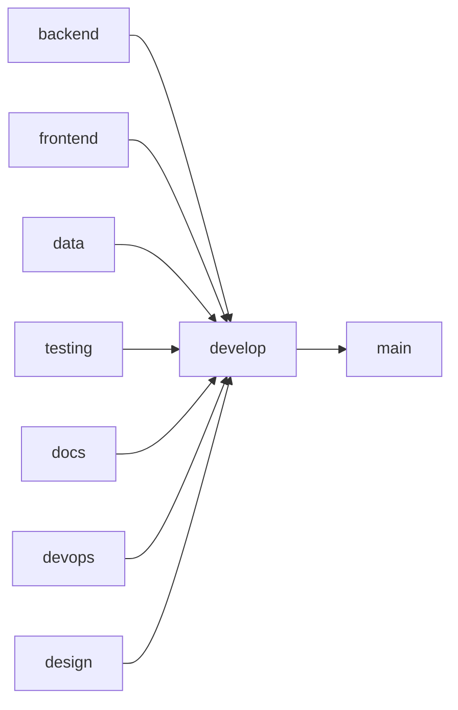

# 🌿 Estrategia de Ramas Git

Este documento describe la estrategia de branching para el proyecto.

## 📋 Estructura de Ramas

### 🏗️ Ramas Base (Obligatorias)

#### 1️⃣ `main`
- **Propósito**: Versión final estable
- **Uso**: Entregas oficiales / producción
- **Protección**: ✅ Protegida (requiere PR y aprobación)
- **Merge desde**: Solo desde `develop`
- **Política**: No se permite push directo

#### 2️⃣ `develop`
- **Propósito**: Rama de integración
- **Uso**: Une backend + frontend + data + testing
- **Protección**: ✅ Protegida (requiere PR)
- **Merge desde**: Ramas de rol (backend, frontend, data, etc.)
- **Base para**: Validación final antes de producción

---

### 🧩 Ramas por Rol (Núcleo del Proyecto)

#### 3️⃣ `backend`
- **Responsable**: Backend Developer
- **Áreas de trabajo**:
  - API REST
  - Lógica del negocio
  - Base de datos
  - Autenticación y roles
- **Directorio principal**: `backend/`
- **Merge hacia**: `develop`

#### 4️⃣ `frontend`
- **Responsable**: Frontend Developer
- **Áreas de trabajo**:
  - Dashboards
  - Visualizaciones
  - Formularios
  - Consumo de la API
- **Directorio principal**: `frontend/`
- **Merge hacia**: `develop`

#### 5️⃣ `data`
- **Responsable**: Data Analyst / Data Scientist
- **Áreas de trabajo**:
  - Limpieza de datos
  - EDA (Exploratory Data Analysis)
  - Modelos predictivos
  - Métricas
- **Directorio principal**: `data/`
- **Merge hacia**: `develop`

#### 6️⃣ `testing`
- **Responsable**: QA / Testing
- **Áreas de trabajo**:
  - Pruebas unitarias
  - Integración
  - End-to-End (E2E)
- **Directorios**: `tests/`, `backend/tests/`, `frontend/tests/`
- **Merge hacia**: `develop`

---

### 🧠 Ramas de Soporte (Nivel Profesional)

#### 7️⃣ `docs`
- **Responsable**: Documentación
- **Áreas de trabajo**:
  - README
  - Manual de usuario
  - Manual técnico
  - Diagramas
- **Directorios**: `docs/`, `README.md`
- **Merge hacia**: `develop`

#### 8️⃣ `devops`
- **Responsable**: DevOps
- **Áreas de trabajo**:
  - Docker
  - CI/CD
  - Despliegue
  - Monitoreo
- **Directorios**: `docker-compose.yml`, `.devcontainer/`, `.github/workflows/`, `devops/`
- **Merge hacia**: `develop`

#### 9️⃣ `design`
- **Responsable**: UX / UI
- **Áreas de trabajo**:
  - Wireframes
  - Mockups
  - Prototipos
  - Assets
- **Directorio principal**: `design/`
- **Merge hacia**: `develop`

---

## 🔄 Flujo de Trabajo

### Diagrama de Flujo



### Proceso de Desarrollo

1. **Desarrollo en rama de rol**
   ```bash
   git checkout backend
   git pull origin backend
   # Hacer cambios
   git add .
   git commit -m "feat: add user authentication"
   git push origin backend
   ```

2. **Pull Request hacia develop**
   - Crear PR desde rama de rol → `develop`
   - Solicitar revisión de código
   - Ejecutar CI/CD automático
   - Aprobar y mergear

3. **Integración en develop**
   - Pruebas de integración automáticas
   - Validación de calidad
   - Testing completo

4. **Release a main**
   - Cuando `develop` está estable
   - Crear PR: `develop` → `main`
   - Aprobación de stakeholders
   - Tag de versión (v1.0.0)
   - Deploy a producción

---

## 📝 Convenciones de Commits

### Formato

```
<type>(<scope>): <subject>

<body>

<footer>
```

### Tipos

- `feat`: Nueva funcionalidad
- `fix`: Corrección de bug
- `docs`: Cambios en documentación
- `style`: Formato, punto y coma, etc.
- `refactor`: Refactorización de código
- `test`: Agregar o modificar tests
- `chore`: Tareas de mantenimiento

### Ejemplos

```bash
# Feature
git commit -m "feat(auth): add JWT authentication"

# Bug fix
git commit -m "fix(dashboard): resolve chart rendering issue"

# Documentation
git commit -m "docs(readme): update installation instructions"

# Testing
git commit -m "test(api): add integration tests for user endpoints"
```

---

## 🔒 Políticas de Protección

### Rama `main`
- ✅ Requiere Pull Request
- ✅ Requiere aprobación de 2 revisores
- ✅ Requiere CI/CD exitoso
- ✅ No permite force push
- ✅ No permite eliminación

### Rama `develop`
- ✅ Requiere Pull Request
- ✅ Requiere aprobación de 1 revisor
- ✅ Requiere CI/CD exitoso
- ✅ No permite force push

### Ramas de Rol
- ⚠️ Requiere Pull Request para merge a `develop`
- ⚠️ Permite push directo (para desarrollo)
- ✅ Requiere CI/CD exitoso antes de merge

---

## 🚀 Comandos Útiles

### Crear y cambiar a rama

```bash
# Crear rama desde develop
git checkout develop
git pull origin develop
git checkout -b backend

# Crear rama desde otra rama de rol
git checkout frontend
git pull origin frontend
git checkout -b feature/new-dashboard
```

### Actualizar rama con develop

```bash
# Opción 1: Merge
git checkout backend
git merge develop

# Opción 2: Rebase (recomendado)
git checkout backend
git rebase develop
```

### Sincronizar con remoto

```bash
# Obtener últimos cambios
git fetch origin

# Ver todas las ramas
git branch -a

# Actualizar rama actual
git pull origin backend
```

---

## 📊 Ejemplo de Workflow Completo

### Desarrollador Backend

```bash
# 1. Actualizar rama backend
git checkout backend
git pull origin backend

# 2. Crear feature branch (opcional)
git checkout -b feature/user-roles

# 3. Desarrollar
# ... hacer cambios en backend/

# 4. Commit
git add backend/
git commit -m "feat(auth): implement role-based access control"

# 5. Push
git push origin feature/user-roles

# 6. Crear PR: feature/user-roles → backend
# 7. Después de merge, crear PR: backend → develop
```

### Desarrollador Frontend

```bash
# 1. Actualizar rama frontend
git checkout frontend
git pull origin frontend

# 2. Desarrollar
# ... hacer cambios en frontend/

# 3. Commit y push
git add frontend/
git commit -m "feat(dashboard): add new KPI widgets"
git push origin frontend

# 4. Crear PR: frontend → develop
```

---

## 🎯 Mejores Prácticas

1. **Commits frecuentes**: Hacer commits pequeños y frecuentes
2. **Mensajes descriptivos**: Usar mensajes de commit claros
3. **Pull antes de push**: Siempre hacer `git pull` antes de `git push`
4. **Resolver conflictos**: Resolver conflictos localmente antes de push
5. **Code review**: Siempre solicitar revisión de código
6. **Tests**: Asegurar que los tests pasen antes de merge
7. **Documentación**: Actualizar docs con cambios significativos

---

## 🆘 Solución de Problemas

### Conflictos de Merge

```bash
# 1. Actualizar develop
git checkout develop
git pull origin develop

# 2. Intentar merge
git checkout backend
git merge develop

# 3. Si hay conflictos, resolverlos manualmente
# Editar archivos con conflictos

# 4. Marcar como resueltos
git add .
git commit -m "merge: resolve conflicts with develop"
```

### Deshacer último commit (local)

```bash
# Mantener cambios
git reset --soft HEAD~1

# Descartar cambios
git reset --hard HEAD~1
```

### Revertir commit (ya pusheado)

```bash
git revert <commit-hash>
git push origin backend
```

---

## 📞 Contacto

Para dudas sobre la estrategia de branching:
- **Tech Lead**: techlead@analytics-platform.com
- **Slack**: #git-workflow
