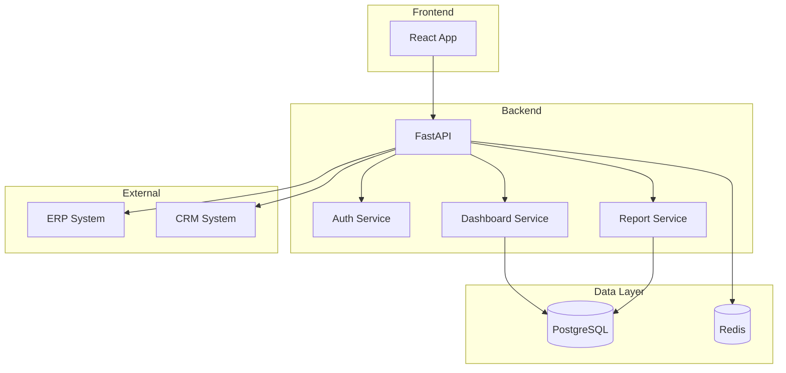
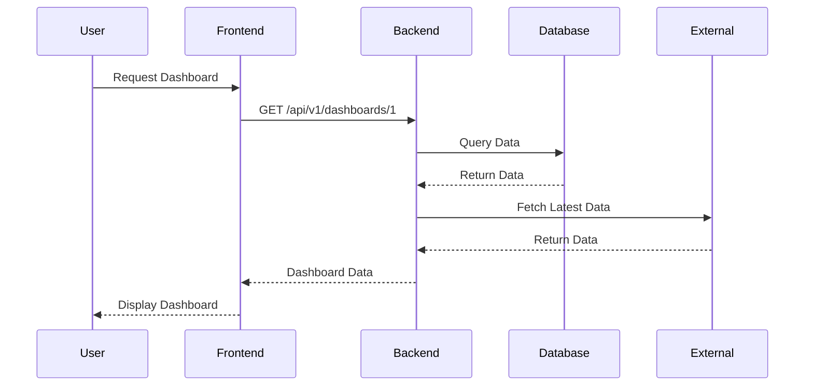

# 📚 Documentación - Plataforma de Analítica de Datos

Documentación técnica y de usuario del proyecto.

## 🏗️ Estructura

```
docs/
├── technical/           # Documentación técnica
│   ├── architecture.md
│   ├── database-schema.md
│   ├── api-design.md
│   └── security.md
├── user-guide/          # Manual de usuario
│   ├── getting-started.md
│   ├── dashboards.md
│   ├── reports.md
│   └── faq.md
├── api/                 # Documentación de API
│   └── openapi.json
├── architecture/        # Diagramas de arquitectura
│   ├── system-overview.md
│   ├── data-flow.md
│   └── deployment.md
├── diagrams/            # Diagramas visuales
│   ├── er-diagram.png
│   ├── architecture.png
│   └── user-flows.png
├── CONTRIBUTING.md      # Guía de contribución
└── README.md
```

## 📖 Documentación Disponible

### Documentación Técnica

#### 1. Arquitectura del Sistema

Ver: [technical/architecture.md](technical/architecture.md)

**Contenido:**
- Visión general del sistema
- Componentes principales
- Patrones de diseño utilizados
- Decisiones arquitectónicas

#### 2. Esquema de Base de Datos

Ver: [technical/database-schema.md](technical/database-schema.md)

**Contenido:**
- Diagrama ER
- Descripción de tablas
- Relaciones
- Índices y optimizaciones

#### 3. Diseño de API

Ver: [technical/api-design.md](technical/api-design.md)

**Contenido:**
- Endpoints disponibles
- Autenticación y autorización
- Formatos de request/response
- Códigos de error

#### 4. Seguridad

Ver: [technical/security.md](technical/security.md)

**Contenido:**
- Autenticación JWT
- Autorización basada en roles
- Encriptación de datos
- Mejores prácticas de seguridad

### Manual de Usuario

#### 1. Primeros Pasos

Ver: [user-guide/getting-started.md](user-guide/getting-started.md)

**Contenido:**
- Acceso al sistema
- Navegación básica
- Configuración de perfil
- Conceptos clave

#### 2. Dashboards

Ver: [user-guide/dashboards.md](user-guide/dashboards.md)

**Contenido:**
- Visualizar dashboards
- Crear dashboards personalizados
- Agregar widgets
- Filtros y drill-down

#### 3. Reportes

Ver: [user-guide/reports.md](user-guide/reports.md)

**Contenido:**
- Generar reportes
- Plantillas predefinidas
- Exportar reportes (PDF, Excel)
- Programar envíos automáticos

#### 4. FAQ

Ver: [user-guide/faq.md](user-guide/faq.md)

**Contenido:**
- Preguntas frecuentes
- Solución de problemas comunes
- Tips y trucos

## 🎨 Diagramas

### Arquitectura del Sistema



### Flujo de Datos



## 📝 Guía de Contribución

Ver: [CONTRIBUTING.md](CONTRIBUTING.md)

### Proceso de Contribución

1. **Fork** el repositorio
2. **Crear rama** desde `develop`
3. **Desarrollar** feature o fix
4. **Escribir tests**
5. **Documentar** cambios
6. **Pull Request** hacia `develop`

### Estándares de Código

#### Backend (Python)

```python
"""
Módulo de autenticación de usuarios.

Este módulo maneja la autenticación JWT y la gestión de sesiones.
"""

from typing import Optional
from datetime import datetime

def authenticate_user(email: str, password: str) -> Optional[User]:
    """
    Autentica un usuario con email y contraseña.
    
    Args:
        email: Email del usuario
        password: Contraseña en texto plano
        
    Returns:
        Usuario autenticado o None si las credenciales son inválidas
        
    Raises:
        ValueError: Si el email no es válido
        
    Example:
        >>> user = authenticate_user("admin@example.com", "pass123")
        >>> print(user.email)
        admin@example.com
    """
    # Implementación
    pass
```

#### Frontend (TypeScript)

```typescript
/**
 * Hook personalizado para gestión de autenticación.
 * 
 * @returns Objeto con estado de autenticación y funciones
 * 
 * @example
 * ```tsx
 * const { user, login, logout } = useAuth();
 * 
 * const handleLogin = async () => {
 *   await login({ email, password });
 * };
 * ```
 */
export const useAuth = () => {
  // Implementación
};
```

### Documentar Cambios

#### Changelog

Mantener actualizado `CHANGELOG.md`:

```markdown
# Changelog

## [1.1.0] - 2024-02-01

### Added
- Nueva funcionalidad de exportación a PowerPoint
- Dashboard de análisis predictivo

### Changed
- Mejorado rendimiento de queries complejas
- Actualizada UI de reportes

### Fixed
- Corregido bug en filtros de fecha
- Solucionado problema de autenticación en Safari
```

## 🔗 Enlaces Útiles

### Documentación Externa

- [FastAPI Docs](https://fastapi.tiangolo.com/)
- [React Docs](https://react.dev/)
- [PostgreSQL Docs](https://www.postgresql.org/docs/)
- [Docker Docs](https://docs.docker.com/)

### Recursos Internos

- [API Swagger](http://localhost:8000/docs)
- [Grafana Dashboards](http://localhost:3001)
- [Jupyter Lab](http://localhost:8888)

## 📊 Glosario de Términos

| Término | Definición |
|---------|------------|
| **Dashboard** | Panel visual interactivo con métricas y gráficos |
| **KPI** | Key Performance Indicator - Indicador clave de rendimiento |
| **Drill-down** | Capacidad de profundizar en datos desde nivel agregado a detalle |
| **ETL** | Extract, Transform, Load - Proceso de integración de datos |
| **Widget** | Componente visual individual en un dashboard |
| **Data Source** | Fuente de datos externa conectada al sistema |

## 🎓 Tutoriales

### Tutorial 1: Crear tu Primer Dashboard

1. Acceder a la sección "Dashboards"
2. Hacer clic en "Nuevo Dashboard"
3. Arrastrar widgets desde la biblioteca
4. Configurar fuentes de datos
5. Aplicar filtros
6. Guardar y compartir

### Tutorial 2: Generar Reporte Personalizado

1. Ir a "Reportes"
2. Seleccionar "Nuevo Reporte"
3. Elegir plantilla o crear desde cero
4. Seleccionar métricas y dimensiones
5. Configurar filtros de fecha
6. Exportar en formato deseado

## 📞 Soporte

### Canales de Comunicación

- **Email**: support@analytics-platform.com
- **Slack**: #analytics-platform-help
- **Jira**: [Crear ticket](https://jira.company.com/analytics)

### Horario de Soporte

- Lunes a Viernes: 9:00 AM - 6:00 PM
- Tiempo de respuesta: < 24 horas

## 🔄 Actualizaciones

Esta documentación se actualiza continuamente. Última actualización: **Enero 2026**

Para sugerir mejoras a la documentación, crear un issue en GitHub con la etiqueta `documentation`.
